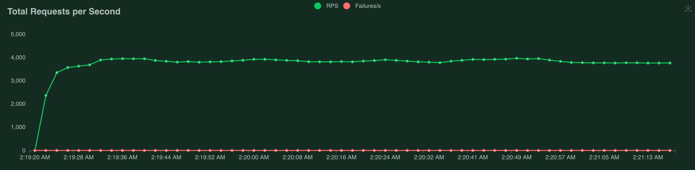

# http1

Basic HTTP/1.1 implemetation in C++

## Task overview

- Run on Linux
- Do not use any third party library, i.e. use only Linux system API.
- Handle at least 10,000 concurrent connections.
- Serve at least 100,000 requests per second on a modern personal computer.
- Serve a simple one or two pages website for demonstration.
- Clarify what HTTP features are supported.

## Implementation

### TCP server architecture

TCP server is implemented by [epoll](https://man7.org/linux/man-pages/man7/epoll.7.html) using edge-triggered mode. This mechanism is capable to handle too many concurrent connections (as many as kernel file descriptors limit) in a single-threaded application.

### Write API
In a non-blocking environment it is not possible to wait for tasks to be completed. So the `write` API of the implemented TCP server will get a callback argument and call it when the write task is completed. This mechanism is able to write a large chunk of data.

### HTTP stream parser

TCP is a stream-based protocol so there is no assumption on received data chunk size. For parsing HTTP/1.1 requests under these conditions a DFA is designed to parse request header and body.

#### Limitations
* Request body will be parsed only if the header contains `content-length` field so `Transfer-Encoding: chunked` is not supported.

#### Parser DFA


* `-` means anything else.
* Cr stands for [carriage return](https://en.wikipedia.org/wiki/Carriage_return) and Lf stands for [line feed](https://en.wikipedia.org/wiki/Line_feed).

## Tests

Tests for HTTP parser and serializer are available in `test` folder. HTTP stream parser is tested against edge cases.

## Demo
An example server will be run by executing following commands.
```bash
mkdir build
cd build
cmake ..
make
./example-server
```
Then "http://127.0.0.1:8000" is available in browsers.

## Benchmark
Benchmarks have been measured in two separated experiments.

### Total requests per second
For measuring server's maximum requests per second rate, A [Rust](https://www.rust-lang.org/)y tester program is implemented using [reqwest](https://github.com/seanmonstar/reqwest) library. The Rust language is chosen because existing of reqwest library and the blazing fast runtime performance.

#### Multi-threaded
The Rust client is multi-threaded and the number of threads is configurable.

#### Execution
After starting example server:
```bash
cd benchmark/rps
cargo build --release
cargo run --release 16 500000 http://127.0.0.1:8000
```
* 16 is the number of threads.
* 500000 is the number of total sending requests.
* Total requests per second will be printed in standard output.

#### Results

Following experiments are executed on a PC with [Intel® Core™ i5-10210U Processor](https://ark.intel.com/content/www/us/en/ark/products/195436/intel-core-i510210u-processor-6m-cache-up-to-4-20-ghz.html). Requests have been sent through **loopback interface**.


* `n` is number of client's threads

### Concurrent connections
Project [locust](https://locust.io/) is used for load testing the HTTP server. The locust file is available in `benchmark/load`

#### Executions
```bash
cd benchmark/load
python3 -m venv venv
source venv/bin/activate
pip3 install -r requirements.txt
python3 -m locust -f locustfile.py
```
Then the address "http://0.0.0.0:8089" is available. For more information see [locust documentations](https://docs.locust.io/en/stable/). 

#### Results

All experiments are executed on two back-to-back connected laptops with a LAN cable.

* Server: [Intel® Core™ i7-6500U Processor](https://www.intel.com/content/www/us/en/products/sku/88194/intel-core-i76500u-processor-4m-cache-up-to-3-10-ghz/specifications.html) with 16GB RAM
* Client: [Apple M1 chip](https://support.apple.com/kb/SP824?locale=en_US) with 8GB RAM


Tests are executed with 10,000 connections so the kernel open file descriptors limit has been increased.
```bash
ulimit -n 16384
```

#### Nginx comparison
Nginx with `worker_processes = 1`:


Nginx with `worker_processes = 4`:

